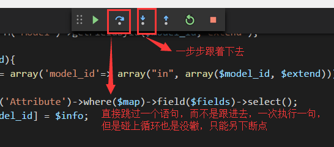

- Vscode支持函数跳转，[更多特性](https://marketplace.visualstudio.com/items?itemName=felixfbecker.php-intellisense)
> 但是需要PHP7.0以上
> 注意不是本地环境PHP7以上，而是VScode的配置 文件>首选项>设置
```json
{
    "php.validate.executablePath": "D:/phpStudy/php/php-7.0.12-nts/php.exe",
    "php.executablePath": "D:/phpStudy/php/php-7.0.12-nts/php.exe",
    "window.zoomLevel": 1,
    "terminal.integrated.shell.windows": "C:\\WINDOWS\\Sysnative\\cmd.exe"
}
```

- Vscode断点调试，通过F10,F11能够进行单步调试，也就是直接看到每个变量的变化，主要看断点设置在哪里，如果设置在最后return，那么所有的变量都将是最终状态，看不到变化的过程和初始值

