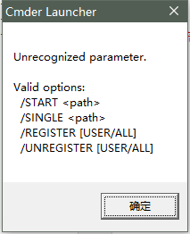

[em_cmd]
button=D:\cmder\Cmder.exe
cmd=D:\cmder\Cmder.exe
param=/START  "%p%"
path=D:\cmder\

> 看到的教程都是 cd "%p" > nul 或者 /dir "%P" /Single
> 然后去google也没啥效果，灵光一闪，这个提示不就在说
> 支持的参数 ：  /START  /SINGLE 么
> 不看英文，睁眼瞎呀。  
> 